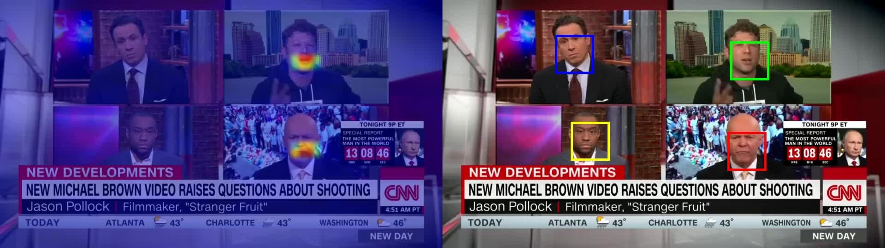
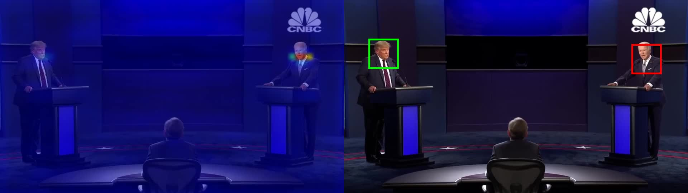

# avobjects
# This repository is re-implementation for "Self-Supervised Learning of audio-visual objects from video" which from ECCV20 paper.


# In the re-implementation project, the focus is on testing the performance of the model for different kinds of video resources.
## (The corresponding example can be found in the "**_speakers_output" file)

### 1. In the standard scenario, the model is able to perform well in the detection of active speakers and the separation of the multi-speaker sources. (E.g. interview_2_speaker_output interview_2_speakers_output)
 
### 2. The model cannot distinguish between the different speakers who appear in the scene in sequence. This means that the sound source and the speaker in the scene should be relatively fixed. (E.g. news_1_speaker_output)

### 3. It is not robust enough to detect multiple speakers in the same scene, especially after the number of speakers is> 4. (E.g. sing_5_speaks_output)

### 4. The model does not distinguish well between different speakers with similar sound sources, for example, the chorus. (E.g. chorus_4_speakers_output)


### [Project page](https://www.robots.ox.ac.uk/~vgg/research/avobjects/) | [Paper](https://arxiv.org/pdf/2008.04237.pdf)

Self-Supervised Learning of audio-visual objects from video.<br>
[Triantafyllos Afouras](http://www.robots.ox.ac.uk/~afourast/),  [Andrew Owens](http://andrewowens.com/), [Joon Son Chung](https://joonson.com/), [Andrew Zisserman](http://www.robots.ox.ac.uk/~az/) <br>
In ECCV 2020.

## Installing dependencies

```
conda env create -f environment.yml
conda activate avobjects
```

## Demo

Download pretrained model weights 

```
bash download_models.bash
```

Run the separation demo 
```
python main.py  --resume checkpoints/avobjects_loc_sep.pt --input_video demo.mp4 --output_dir demo_out 
```

### Output

<p align="center">
  
</p>

The output directory will also contain videos with the separated audio for every tracked speaker. 

**Optional**: You can point a web browser to the output directory to view the video results.
If working on a remote machine, you can run a web server on port 8000 by running
```
cd demo_out; python3 -m http.server 8000
```

## Running on custom video

To run the model on a new video, add it into the media/ directory and select it using the --input_video argument. 

You can specify the number of AV objects to track using the --n_peaks argument.

For example 

```
python main.py  --resume checkpoints/avobjects_loc_sep.pt --n_peaks 2 --input_video trump_biden_debate.mp4  --output_dir trum_biden_debate_out   
```

### Output

<p align="center">
  
</p>

## Citation

If you use this code for your research, please cite:

```BibTeX
@InProceedings{Afouras20b,
                 author       = "Triantafyllos Afouras and Andrew Owens and Joon~Son Chung and Andrew Zisserman",
                 title        = "Self-Supervised Learning of Audio-Visual Objects from Video",
                 booktitle    = "European Conference on Computer Vision",
                 year         = "2020",
                }
```

